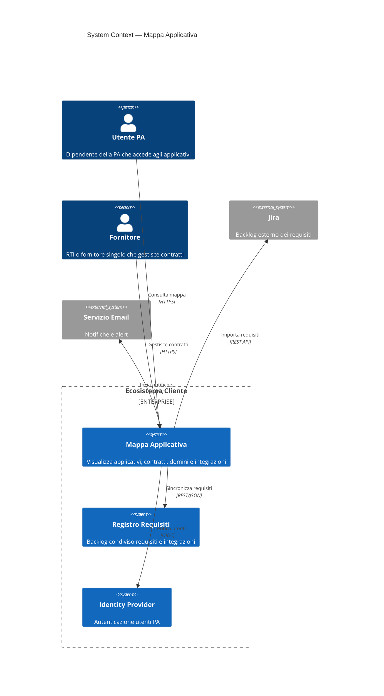
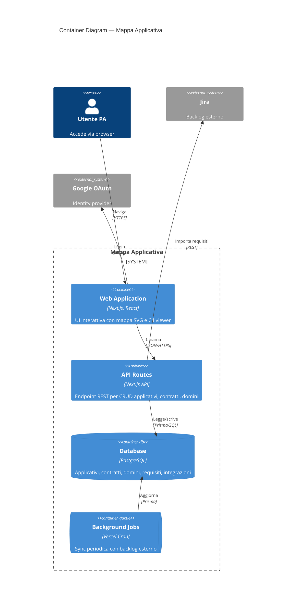
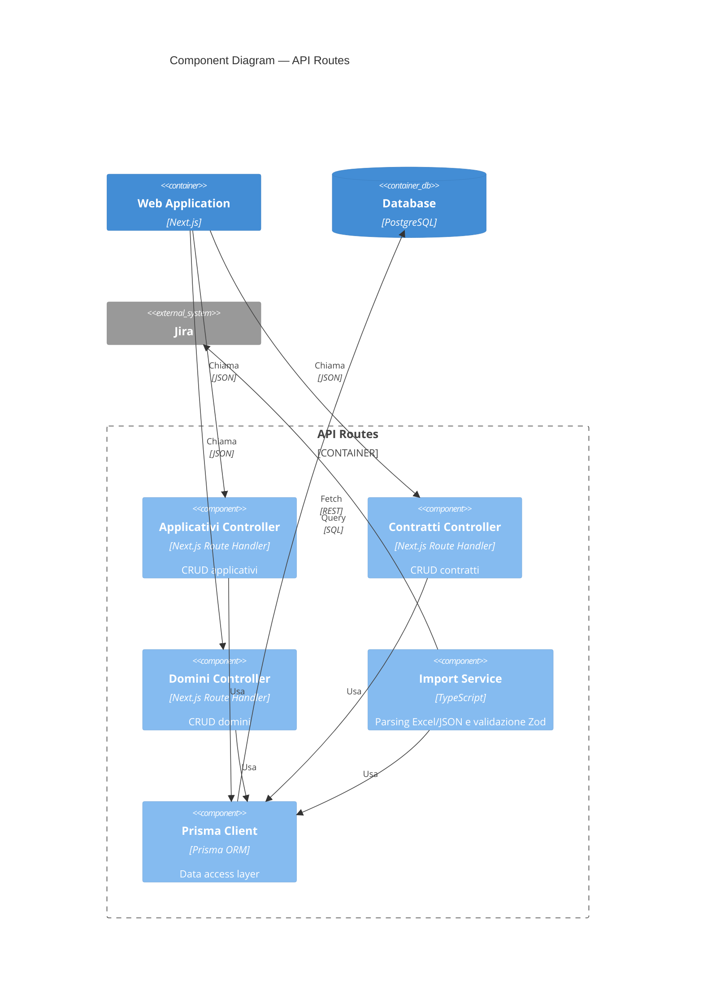
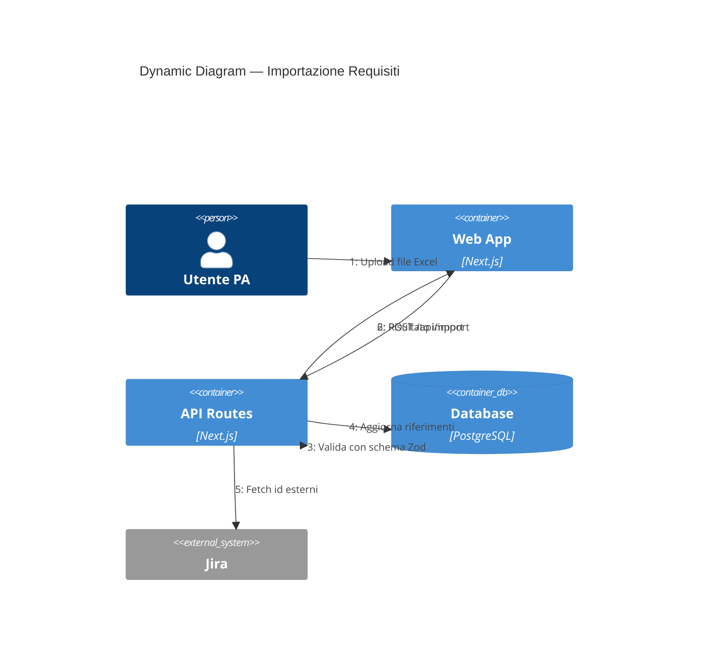
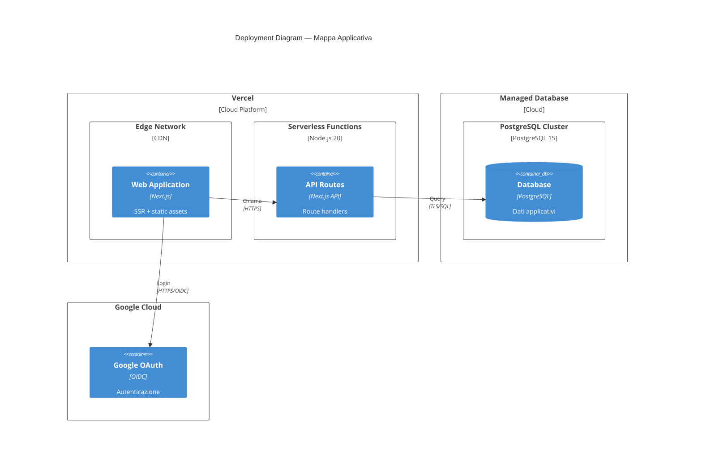
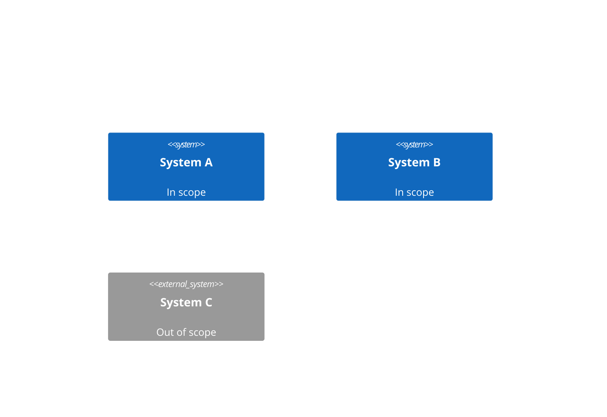

# R1 — Findings: Mermaid C4 Diagram Capabilities

Research date: 2026-08-24  
Mermaid version tested: **11.17.1** (released 2026-08-24)  
Purpose: feed ticket C3 (C4 Visualizer component)

---

## 1. C4 Diagram Types — Syntax Reference

Mermaid supports **five** C4 diagram types. All share a common element/relationship vocabulary.

> **Status**: C4 diagrams are still marked **experimental** in Mermaid docs.  
> "The syntax and properties can change in future releases."

### 1.1 C4Context (System Landscape / System Context)



### 1.2 C4Container



### 1.3 C4Component



### 1.4 C4Dynamic

Uses `RelIndex` instead of `Rel` to show numbered sequence of interactions.



### 1.5 C4Deployment



### Element Type Reference

| Function | Parameters | Diagram Types |
|---|---|---|
| `Person(alias, label, ?descr)` | alias required | All |
| `Person_Ext(alias, label, ?descr)` | external person | All |
| `System(alias, label, ?descr)` | internal system | Context |
| `System_Ext(alias, label, ?descr)` | external system | Context |
| `SystemDb(alias, label, ?descr)` | system as database | Context |
| `SystemQueue(alias, label, ?descr)` | system as queue | Context |
| `Container(alias, label, ?techn, ?descr)` | container | Container+ |
| `ContainerDb(alias, label, ?techn, ?descr)` | database container | Container+ |
| `ContainerQueue(alias, label, ?techn, ?descr)` | queue container | Container+ |
| `Component(alias, label, ?techn, ?descr)` | component | Component |
| `ComponentDb(alias, label, ?techn, ?descr)` | DB component | Component |
| `Deployment_Node(alias, label, ?type, ?descr)` | infra node | Deployment |
| `Node(alias, label, ?type, ?descr)` | alias for Deployment_Node | Deployment |

All types have `_Ext` variants for external elements.

### Boundary Types

| Function | Usage |
|---|---|
| `Enterprise_Boundary(alias, label)` | top-level org boundary |
| `System_Boundary(alias, label)` | groups containers within a system |
| `Container_Boundary(alias, label)` | groups components within a container |
| `Boundary(alias, label, ?type)` | generic boundary with custom type label |

### Relationship Types

| Function | Usage |
|---|---|
| `Rel(from, to, label, ?techn, ?descr)` | standard relationship |
| `BiRel(from, to, label, ?techn)` | bidirectional |
| `Rel_U(from, to, label)` | force upward layout |
| `Rel_D(from, to, label)` | force downward layout |
| `Rel_L(from, to, label)` | force leftward layout |
| `Rel_R(from, to, label)` | force rightward layout |
| `Rel_Back(from, to, label)` | reverse direction |
| `RelIndex(index, from, to, label)` | numbered (C4Dynamic only) |

---

## 2. Styling and Theming

### 2.1 UpdateElementStyle

Per-element style override. Place at the end of the diagram definition.

```
UpdateElementStyle(mapapp, $bgColor="blue", $fontColor="white", $borderColor="darkblue")
UpdateElementStyle(jira, $bgColor="#999999", $fontColor="white", $borderColor="#666666")
```

Parameters (all optional, named with `$` prefix):
- `$bgColor` — background color (CSS color or hex)
- `$fontColor` — text color
- `$borderColor` — border color
- `$shadowing` — enable/disable shadow
- `$shape` — `RoundedBoxShape()` or `EightSidedShape()`
- `$sprite`, `$techn`, `$legendText`, `$legendSprite` — not yet functional

### 2.2 UpdateRelStyle

```
UpdateRelStyle(webapp, api, $textColor="red", $lineColor="red", $offsetX="-40", $offsetY="20")
```

Parameters:
- `$textColor`, `$lineColor` — colors
- `$offsetX`, `$offsetY` — adjust label position (pixels, as string)

### 2.3 Global C4 Config (via mermaid.initialize)

```typescript
mermaid.initialize({
  c4: {
    diagramMarginX: 50,
    diagramMarginY: 10,
    c4ShapeMargin: 50,
    c4ShapePadding: 20,
    width: 216,          // element box width
    height: 60,          // element box height
    boxMargin: 10,
    c4ShapeInRow: 4,     // max shapes per row
    c4BoundaryInRow: 2,  // max boundaries per row
    wrap: true,          // text wrapping (default true since 11.17.1)
    // Per-element-type font/color overrides:
    // person_bg_color, system_bg_color, container_bg_color, etc.
    // personFontSize, systemFontSize, containerFontSize, etc.
  }
});
```

### 2.4 Scope-based Coloring Strategy

To color nodes by scope (e.g., "in scope" vs "out of scope"), use `UpdateElementStyle` per element after the diagram body:



**Limitation**: There is no `classDef`-like mechanism for C4 diagrams (unlike flowcharts). You must style each element individually. To automate this, generate the `UpdateElementStyle` lines programmatically when building the diagram string.

### 2.5 Theme Support — Current State

C4 diagrams currently use **fixed CSS colors** that do not respond to Mermaid theme changes (`default`, `dark`, `forest`, `neutral`). The fill color is a literal white, which reads poorly on dark themes. This is a known issue being addressed in the unified renderer migration (issue #7849). The `c4-beta` syntax and unified pipeline (expected in 11.18+) will bring theme-aware colors.

---

## 3. Click Handlers / Interactivity

### 3.1 The `click` Directive in C4

The `click` directive that works in flowcharts (`click nodeId callback "tooltip"`) is **NOT officially documented** for C4 diagrams. It is listed among the "not supported" features for C4.

### 3.2 Workaround: SVG Event Listeners After Render

The reliable approach is to attach event listeners to the rendered SVG elements post-render:

```typescript
// After mermaid.render() produces SVG and you insert it into the DOM:
const svgElement = containerRef.current?.querySelector('svg');
if (svgElement) {
  // C4 nodes are rendered as <g> groups with specific IDs matching the alias
  const nodes = svgElement.querySelectorAll('g[id]');
  nodes.forEach((node) => {
    const alias = node.id;
    node.style.cursor = 'pointer';
    node.addEventListener('click', () => {
      onNodeClick(alias);  // your callback
    });
  });
}
```

### 3.3 Alternative: securityLevel "loose" + callback

If you set `securityLevel: 'loose'`, Mermaid enables click directives globally. You can try adding `click` directives to your C4 definition and using `bindFunctions`:

```typescript
mermaid.initialize({ securityLevel: 'loose', startOnLoad: false });

const { svg, bindFunctions } = await mermaid.render('c4-diagram', definition);
container.innerHTML = svg;
if (bindFunctions) {
  bindFunctions(container);
}
```

**Caveats**:
- `securityLevel: 'loose'` opens XSS vectors if diagram source is user-generated
- The callback function must be a global `window` function, not a React closure
- C4 click support is undocumented and may not work reliably

### 3.4 Recommended Approach for This Project

Use the **SVG event listener approach** (3.2). Since the diagram source is application-generated (not user input), there is no XSS risk. Parse the SVG DOM after render, find elements by alias, and wire React callbacks.

---

## 4. React Integration

### 4.1 Recommended: Direct `mermaid` npm package with useEffect

No wrapper library is needed. The `mermaid` npm package works directly.

```tsx
"use client";

import { useEffect, useRef, useCallback } from "react";
import type { MermaidConfig } from "mermaid";

interface MermaidDiagramProps {
  definition: string;
  id?: string;
  config?: MermaidConfig;
  onNodeClick?: (alias: string) => void;
}

let mermaidModule: typeof import("mermaid") | null = null;

export function MermaidDiagram({
  definition,
  id = "mermaid-diagram",
  config,
  onNodeClick,
}: MermaidDiagramProps) {
  const containerRef = useRef<HTMLDivElement>(null);
  const renderCount = useRef(0);

  const renderDiagram = useCallback(async () => {
    if (!containerRef.current) return;

    // Dynamic import — mermaid uses browser APIs, cannot run on server
    if (!mermaidModule) {
      mermaidModule = await import("mermaid");
    }
    const mermaid = mermaidModule.default;

    mermaid.initialize({
      startOnLoad: false,
      securityLevel: "strict",
      c4: {
        c4ShapeInRow: 3,
        c4BoundaryInRow: 1,
        wrap: true,
      },
      ...config,
    });

    try {
      // Unique ID for each render to avoid conflicts
      const renderId = `${id}-${renderCount.current++}`;
      const { svg, bindFunctions } = await mermaid.render(renderId, definition);

      containerRef.current.innerHTML = svg;

      if (bindFunctions) {
        bindFunctions(containerRef.current);
      }

      // Attach click handlers to SVG nodes
      if (onNodeClick) {
        const svgEl = containerRef.current.querySelector("svg");
        if (svgEl) {
          const groups = svgEl.querySelectorAll("g[id]");
          groups.forEach((g) => {
            const el = g as SVGGElement;
            el.style.cursor = "pointer";
            el.addEventListener("click", (e) => {
              e.stopPropagation();
              onNodeClick(el.id);
            });
          });
        }
      }
    } catch (err) {
      console.error("Mermaid render error:", err);
      if (containerRef.current) {
        containerRef.current.innerHTML =
          `<pre style="color:red">${(err as Error).message}</pre>`;
      }
    }
  }, [definition, id, config, onNodeClick]);

  useEffect(() => {
    renderDiagram();
  }, [renderDiagram]);

  return <div ref={containerRef} className="mermaid-container" />;
}
```

### 4.2 Usage in a Page Component

```tsx
"use client";

import { useState } from "react";
import { MermaidDiagram } from "@/components/MermaidDiagram";

type C4Level = "landscape" | "context" | "container";

export function C4Viewer() {
  const [level, setLevel] = useState<C4Level>("landscape");
  const [selectedSystem, setSelectedSystem] = useState<string | null>(null);

  const definition = buildC4Definition(level, selectedSystem);

  function handleNodeClick(alias: string) {
    if (level === "landscape") {
      setSelectedSystem(alias);
      setLevel("context");
    } else if (level === "context") {
      setSelectedSystem(alias);
      setLevel("container");
    }
  }

  return (
    <div>
      <nav>
        <button onClick={() => { setLevel("landscape"); setSelectedSystem(null); }}>
          Landscape
        </button>
        {level !== "landscape" && (
          <button onClick={() => setLevel("context")}>Context</button>
        )}
      </nav>
      <MermaidDiagram
        definition={definition}
        onNodeClick={handleNodeClick}
        id={`c4-${level}`}
      />
    </div>
  );
}

function buildC4Definition(level: C4Level, systemAlias: string | null): string {
  // Generate mermaid syntax from your data model
  // ...
}
```

### 4.3 Why Not a Wrapper Library?

| Library | Status | Verdict |
|---|---|---|
| `react-mermaid` | Abandoned (2015), uses mermaid 0.5 | Do not use |
| `react-x-mermaid` | Active, but thin wrapper | Unnecessary overhead |
| `@lightenna/react-mermaid-diagram` | Active, simple | Decent but no click support |
| `mermaidcn` | Active, shadcn-compatible, zoom/pan | Worth evaluating if zoom/pan needed |

**Recommendation**: Use `mermaid` directly with a custom component. It is ~30 lines of code, gives full control over click handlers and re-renders, and avoids a dependency that may lag behind mermaid releases.

If zoom/pan is needed later, evaluate `mermaidcn` or implement with CSS `transform` + pointer events.

---

## 5. Version and Stability

| Version | Date | C4 Notes |
|---|---|---|
| **11.17.1** | 2026-08-24 | Latest. Fix: C4 label wrapping regression from 11.17.0 |
| **11.17.0** | 2026-08-19 | C4 shapes via unified shape system; fix `$tags`/`$link`/`$sprite` named attrs |
| **11.16.x** | 2026-08 | Stable baseline |
| **10.9.8** | 2026-08-04 | v10 LTS patch |

### Recommendation

Pin to **`^11.17.1`** in `package.json`. This is the latest stable release with C4 fixes.

```json
{
  "dependencies": {
    "mermaid": "^11.17.1"
  }
}
```

### Known Issues

1. **Experimental status**: C4 syntax may change in future releases
2. **Fixed CSS colors**: C4 does not respond to Mermaid theme switching (dark mode broken)
3. **No automated layout**: Position depends on statement order, not a graph algorithm
4. **Missing features**: sprites, tags, links, legends not functional yet
5. **c4-beta coming**: Issue #7849 tracks migration to unified renderer with dagre/ELK layout, theming, and a new `c4-beta` syntax. Expected in 11.18+

---

## 6. Limits and Layout

### Node Count Limits

There is no hard limit, but practical readability thresholds:

| Diagram Type | Comfortable | Crowded | Unreadable |
|---|---|---|---|
| C4Context | 8-10 systems | 12-15 | 20+ |
| C4Container | 6-8 containers | 10-12 | 15+ |
| C4Component | 8-10 components | 12-15 | 20+ |
| C4Deployment | 4-5 deployment nodes | 8-10 | 12+ |

These limits are tighter than flowcharts because C4 boxes contain more text (label + technology + description).

### Layout Configuration

```
UpdateLayoutConfig($c4ShapeInRow="3", $c4BoundaryInRow="1")
```

- `c4ShapeInRow` (default 4): elements per row before wrapping
- `c4BoundaryInRow` (default 2): boundaries per row

**No direction control**: Unlike flowcharts (`TB`, `LR`), C4 diagrams always render top-to-bottom. The only layout lever is element ordering in the source and `c4ShapeInRow`/`c4BoundaryInRow`.

### Layout Tips

- Put the most important elements first in the source
- Group related elements in boundaries to create visual clusters
- Use `Rel_L`, `Rel_R`, `Rel_U`, `Rel_D` to hint relationship direction
- Keep descriptions short to avoid box overflow
- For complex systems, split into multiple diagrams at different C4 levels rather than cramming everything into one

---

## 7. Dynamic Re-rendering

### The Pattern

Re-render by calling `mermaid.render()` again with a new definition string. The key requirements:

1. **Unique render ID per call** — Mermaid caches by ID. Reusing an ID causes stale renders.
2. **Replace innerHTML** — Swap the entire SVG.
3. **Re-bind events** — Click handlers must be re-attached after each render.

```typescript
// In the MermaidDiagram component above, this is handled by:
// - useEffect with [definition] dependency triggers re-render
// - renderCount.current++ generates unique IDs
// - onNodeClick handlers are re-attached after each render
```

### Drill-down Flow

```
User clicks System A on Landscape diagram
  -> onNodeClick("systemA")
  -> setLevel("context"), setSelectedSystem("systemA")
  -> buildC4Definition("context", "systemA") generates new C4Container string
  -> useEffect fires, mermaid.render() produces new SVG
  -> New click handlers attached to container nodes
  -> User clicks Container X
  -> Drill-down to Component level
```

### Performance Notes

- `mermaid.render()` is synchronous-ish (returns a Promise but renders fast for <20 nodes)
- For rapid transitions, debounce with `setTimeout` (300-500ms)
- Each render creates a new SVG — there is no incremental/diff update
- For smooth UX, consider a fade transition on the container div between renders

---

## Summary: Go / No-Go for Ticket C3

| Requirement | Support | Risk |
|---|---|---|
| System Landscape diagram | C4Context | Low |
| System Context diagram | C4Context with boundaries | Low |
| Container diagram | C4Container | Low |
| Click-to-drill-down | SVG event listeners post-render | Medium — must parse SVG DOM |
| Custom colors by scope | UpdateElementStyle per element | Low — verbose but works |
| Dark mode | Not supported by C4 renderer | High — fixed colors |
| React/Next.js "use client" | Dynamic import + useEffect | Low |
| Re-render on data change | mermaid.render() with new definition | Low |
| Zoom/pan | Not built-in; needs CSS transform or mermaidcn | Medium |

### Decision

**Proceed with Mermaid C4** for the POC. The main risk is dark-mode support (fixed colors). Mitigate by:
1. Setting explicit light background on the diagram container
2. Using `UpdateElementStyle` to set colors from the app's design tokens
3. Monitoring issue #7849 for the unified renderer with theme support

If C4 limitations become blocking (especially layout control), evaluate **Structurizr DSL** export + external renderer as a fallback (see ticket R2).

---

## Sources

- [Mermaid C4 Docs](https://mermaid.js.org/syntax/c4.html)
- [Mermaid Usage/API Docs](https://mermaid.js.org/config/usage.html)
- [C4 Config Schema](https://mermaid.ai/open-source/config/schema-docs/config-defs-c4-diagram-config.html)
- [C4 Unified Renderer Migration — Issue #7849](https://github.com/mermaid-js/mermaid/issues/7849)
- [Click Events in React — Issue #717](https://github.com/mermaid-js/mermaid/issues/717)
- [Click Events in React — Issue #1402](https://github.com/mermaid-js/mermaid/issues/1402)
- [securityLevel click behavior — Issue #6809](https://github.com/mermaid-js/mermaid/issues/6809)
- [Mermaid Releases](https://github.com/mermaid-js/mermaid/releases)
- [mermaidcn — shadcn-compatible renderer](https://mermaidcn.vercel.app/)
- [C4 Practical Guide — Luke Merrett](https://lukemerrett.com/building-c4-diagrams-in-mermaid/)
- [Mermaid Studio C4 Reference](https://mermaidstudio.dev/docs/diagram-types/c4/)
- [Mermaid Viewer C4 Reference](https://docs.mermaidviewer.com/diagrams/c4)
